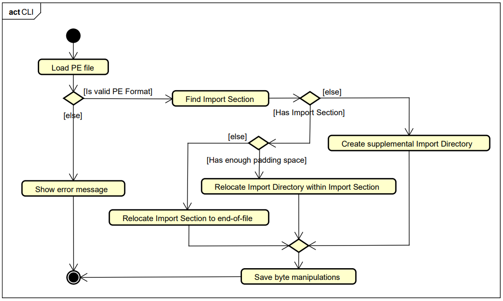

[](./LICENSE)

This work explores distinct methods of subverting the Windows image loader to execute adversarial payloads. Such methods use byte-level manipulation techniques to modify the `Import Directory` and, when necessary, the `Import Section` of a binary file. This forces Windows to load an additional executable binary into the host's (target) process virtual address space. These methods -- implemented as a command-line tool -- can serve as alternatives to traditional export forwarding techniques (i.e. Proxy DLLs), which rely on structurally empty binaries.

## Building

No dependencies required, all data structures of the PE format are defined within `PEFormat.h`.

**MinGW build:**
```sh
g++ -g main.cpp -o WrappEm.exe -std=c++17
```

**LLVM-clang build:**
```sh
clang++ -g main.cpp -o WrappEm.exe -std=c++17
```

**MSVC build:**
```sh
cl main.cpp /std:c++17 /EHsc /out:WrappEm.exe /Debug
```

## Artifacts

The `/artifacts` directory contains the expected outputs generated by this tool. These files also serve as reproducible dataset.

> [!CAUTION]
> These files include manipulated binaries and/or active payloads. Execute them at your own risk, preferably in an isolated or sandbox environment.

* **`00_payload` (Payload):** Sample source code and compiled binaries designed for runtime execution.
* **`01_dlls` (DLL Hijacking):** Demonstrates subverting the Windows Image Loader. The tool byte-manipulates `version.dll` to sideload `payload.dll` when executed by `benignTarget.exe`.
* **`02_executable` (Direct Modification):** Demonstrates direct binary manipulation. The tool alters `main.exe` to explicitly load `payload.dll`.
* **`03_proxy` (Proxy DLL):** A manually constructed export-forwarding DLL, provided as a baseline to compare against the byte-manipulation techniques.

## Target manipulation steps



## DISCLAIMER

THIS TOOL AND ITS ASSOCIATED ARTIFACTS ARE PROVIDED FOR EDUCATIONAL AND ACADEMIC RESEARCH PURPOSES ONLY. THE AUTHOR(S) AND CONTRIBUTOR(S) ARE NOT RESPONSIBLE FOR ANY MISUSE, DAMAGE, DATA LOSS, OR SYSTEM INSTABILITY RESULTING FROM THE EXECUTION OR MODIFICATION OF THIS SOFTWARE. DO NOT DEPLOY THIS TOOL OR ITS GENERATED ARTIFACTS ON SYSTEMS, NETWORKS, OR BINARIES FOR WHICH YOU DO NOT HAVE EXPLICIT, DOCUMENTED PERMISSION. BY USING THIS TOOL, YOU ACKNOWLEDGE THAT YOU UNDERSTAND THESE RISKS AND AGREE TO USE IT IN A LEGALLY AND ETHICALLY RESPONSIBLE MANNER.
